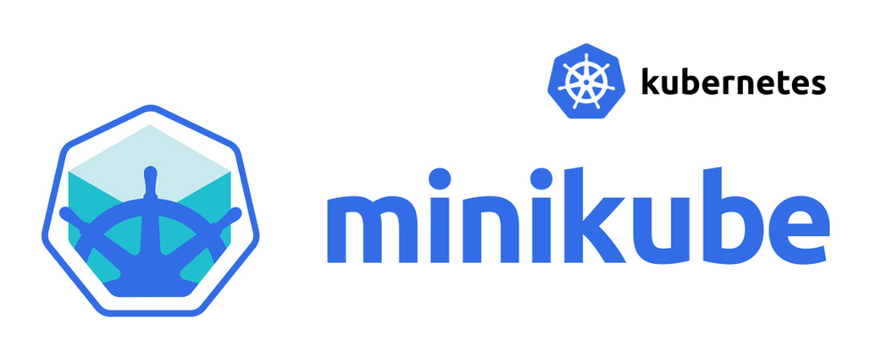

<p align="center">
  
</p>

# [Minikube](https://minikube.sigs.k8s.io/docs/start/) 
– minikube quickly sets up a local Kubernetes cluster on macOS, Linux, and Windows.

## 1. Інсталяція Minikube на Linux
Встановлення Minikube на Ubuntu Linux 20.04 LTS з VirtualBox v7.0.   
Це інсталювання передбачає, що на нашій робочій станції Linux не встановлено жодного іншого програмного забезпечення для ізоляції, зокрема драйверів KVM2, QEMU, Docker Engine або Podman.  


### LINKS:
- [Установка Kubernetes с помощью Minikube](https://kubernetes.io/ru/docs/setup/learning-environment/minikube/)
- [Prometheus / The Linux Foundation INTRO101 / Основи Kubernetes](https://apps.prometheus.org.ua/learning/course/course-v1:LinuxFoundation+INTRO101+2023_T1/home)
- [Шпаргалка по kubectl](https://kubernetes.io/ru/docs/reference/kubectl/cheatsheet/)
- [How To Use minikube for Local Kubernetes Development and Testing](https://www.digitalocean.com/community/tutorials/how-to-use-minikube-for-local-kubernetes-development-and-testing)


### :warning: :warning:
```console
Failed to connect to ubuntu.com meta-release-lts

# Иногда после входа в систему появляется сообщение Failed to connect to https://changelogs.ubuntu.com/meta-release-lts. Check your Internet connection or proxy settings

# Чтобы убрать это сообщение, выполните команду

sudo truncate -s 0 /var/lib/ubuntu-release-upgrader/release-upgrade-available
```